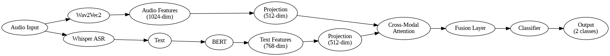

# Multimodal Voice Anti-Spoofing Detection

## Overview
A novel multimodal approach for voice anti-spoofing detection that leverages both audio and text features through Wav2Vec2, Whisper, and BERT models.

## Architecture


### Components
**Audio Branch**
* Wav2Vec2
 * Audio feature extraction
 * Output dimension: 1024
 * Captures acoustic patterns and temporal dynamics

**Text Branch**
* Whisper ASR
 * Speech-to-text transcription
 * Handles varied audio conditions
* BERT
 * Text embeddings (768-dim)
 * Semantic understanding

**Fusion Module**
* Projection Layers
 * Audio: 1024 → 512 dimensions
 * Text: 768 → 512 dimensions
* Cross-Modal Attention
 * Audio-Text feature interaction
 * Dynamic feature weighting
* MLP Classifier
 * Binary classification (genuine/spoof)

## Dataset
**Training Set**
* 2000 samples from ASVspoof2019 LA
 * 1000 genuine samples
 * 1000 spoof samples

**Evaluation Set**
* 1000 samples from ASVspoof2019 LA eval subset
 * 500 genuine samples
 * 500 spoof samples

## Requirements
```bash
pip install -r requirements.txt
